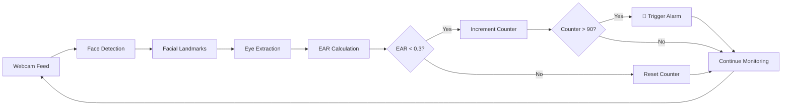

# 🚗 Driver Monitoring System

<div align="center">


**A real-time drowsiness detection system that monitors driver alertness using computer vision and facial landmark detection.**

[Features](#-features) • [Demo](#-demo) • [Installation](#-installation) • [Usage](#-usage) • [How It Works](#-how-it-works) • [Contributing](#-contributing)

</div>

---

## 📋 Table of Contents

- [Overview](#-overview)
- [Features](#-features)
- [Demo](#-demo)
- [How It Works](#-how-it-works)
- [Installation](#-installation)
- [Usage](#-usage)
- [Project Structure](#-project-structure)
- [Configuration](#-configuration)
- [Technologies Used](#-technologies-used)
- [Requirements](#-requirements)
- [Troubleshooting](#-troubleshooting)
- [Future Enhancements](#-future-enhancements)
- [Contributing](#-contributing)
- [License](#-license)
- [Author](#-author)

---

## 🌟 Overview

The **Driver Monitoring System** is an intelligent safety application designed to prevent accidents caused by driver drowsiness. Using advanced computer vision techniques and facial landmark detection, the system continuously monitors the driver's eye movements in real-time. When drowsiness is detected (eyes closed for an extended period), an audio alarm is triggered to alert the driver.

This project leverages the power of **dlib's 68-point facial landmark detector** and **Eye Aspect Ratio (EAR)** calculations to accurately determine eye closure and detect drowsiness with high precision.

---

## ✨ Features

- 🎥 **Real-time Face Detection** - Instantly detects and tracks driver's face using Haar Cascade Classifier
- 👁️ **Eye Tracking** - Precisely monitors both left and right eye movements using 68 facial landmarks
- 📊 **Eye Aspect Ratio (EAR) Calculation** - Mathematical approach to determine eye closure state
- 🔔 **Audio Alert System** - Plays continuous alarm sound when drowsiness is detected
- 🖥️ **GUI Dashboard** - Clean Tkinter interface displaying real-time eye status
- ⚡ **Multi-threaded Architecture** - Smooth performance with separate threads for detection and GUI updates
- 🎯 **Visual Feedback** - Draws eye contours and face rectangles on video feed
- ⚙️ **Configurable Thresholds** - Easily adjust sensitivity settings for different use cases
- 🔄 **Continuous Monitoring** - Runs indefinitely until manually stopped
- 💻 **Cross-platform Support** - Works on Windows, macOS, and Linux

---

## 🎬 Demo

### System in Action

The system displays:
- Live video feed from webcam
- Blue rectangle around detected face
- Green contours around detected eyes
- Real-time eye status (Open/Closed)
- Audio alarm when drowsiness is detected

**Eye States:**
- ✅ **Eyes Open** - Normal driving condition
- ⚠️ **Eyes Closed** - Drowsiness detected, alarm triggered

---

## 🔬 How It Works

### Eye Aspect Ratio (EAR) Algorithm

The system uses the **Eye Aspect Ratio** formula to detect eye closure:

```
EAR = (||p2 - p6|| + ||p3 - p5||) / (2 * ||p1 - p4||)
```

Where:
- `p1, p2, p3, p4, p5, p6` are the 6 facial landmarks around each eye
- `||·||` denotes Euclidean distance

**Detection Logic:**
1. **Face Detection**: Haar Cascade detects face in frame
2. **Landmark Detection**: dlib identifies 68 facial landmarks
3. **Eye Extraction**: Extract left and right eye coordinates
4. **EAR Calculation**: Compute Eye Aspect Ratio for both eyes
5. **Threshold Comparison**: Compare EAR against threshold (0.3)
6. **Frame Counting**: Count consecutive frames with closed eyes
7. **Alert Trigger**: If threshold exceeded (90 frames ≈ 3 seconds), trigger alarm

### Detection Flow



---

## 🚀 Installation

### Prerequisites

- Python 3.7 or higher
- Webcam/Camera
- Internet connection (for initial setup)

### Step 1: Clone the Repository

```bash
git clone https://github.com/shahid1330/Driver-Monitoring-System.git
cd Driver-Monitoring-System
```

### Step 2: Create Virtual Environment (Recommended)

```bash
# Windows
python -m venv venv
venv\Scripts\activate

# macOS/Linux
python3 -m venv venv
source venv/bin/activate
```

### Step 3: Install Dependencies

```bash
pip install opencv-python scipy imutils numpy pygame dlib
```

**Or install using requirements.txt:**

```bash
pip install -r requirements.txt
```

### Step 4: Download Required Files

1. **shape_predictor_68_face_landmarks.dat**
   ```bash
   # Download from dlib's official source
   wget http://dlib.net/files/shape_predictor_68_face_landmarks.dat.bz2
   bzip2 -d shape_predictor_68_face_landmarks.dat.bz2
   ```

2. **alert.wav**
   - Add your own alarm sound file named `alert.wav` in the project directory
   - Or download a sample alarm sound and rename it to `alert.wav`

3. **Haar Cascade Files** (already included in the repository)
   - `haarcascade_frontalface_default.xml`
   - `haarcascade_eye.xml`

---

## 💻 Usage

### Basic Usage

```bash
python drowsiness_detect.py
```

### Running the System

1. **Start the Application**
   - Run the Python script
   - Grant camera permissions if prompted

2. **Position Yourself**
   - Sit in front of the camera
   - Ensure good lighting conditions
   - Face should be clearly visible

3. **Monitor Status**
   - GUI window shows eye status
   - Video feed displays face and eye detection
   - Audio alarm sounds when drowsiness detected

4. **Stop the System**
   - Press `q` in the video window
   - Or close the GUI window

### Keyboard Controls

| Key | Action |
|-----|--------|
| `q` | Quit application |

---

## 📁 Project Structure

```
Driver-Monitoring-System/
│
├── drowsiness_detect.py              # Main application script
├── haarcascade_frontalface_default.xml  # Face detection classifier
├── haarcascade_eye.xml                # Eye detection classifier
├── shape_predictor_68_face_landmarks.dat  # Facial landmark model (download separately)
├── alert.wav                          # Alert sound file (add your own)
├── README.md                          # Project documentation
├── requirements.txt                   # Python dependencies
├── LICENSE                            # MIT License
└── .gitignore                         # Git ignore file
```

---

## ⚙️ Configuration

### Adjustable Parameters

Edit these constants in `drowsiness_detect.py`:

```python
# Eye Aspect Ratio threshold (default: 0.3)
EYE_ASPECT_RATIO_THRESHOLD = 0.3  # Lower = more sensitive

# Consecutive frames threshold (default: 90 frames ≈ 3 seconds at 30 FPS)
CLOSED_EYE_THRESHOLD = 3 * 30  # Adjust based on desired delay
```

### Sensitivity Tuning

| Parameter | Value | Effect |
|-----------|-------|--------|
| `EYE_ASPECT_RATIO_THRESHOLD` | < 0.3 | More sensitive (triggers earlier) |
| `EYE_ASPECT_RATIO_THRESHOLD` | > 0.3 | Less sensitive (triggers later) |
| `CLOSED_EYE_THRESHOLD` | Lower | Faster alert |
| `CLOSED_EYE_THRESHOLD` | Higher | Delayed alert |

---

## 🛠️ Technologies Used

| Technology | Purpose |
|------------|---------|
| **Python 3.7+** | Core programming language |
| **OpenCV** | Computer vision and image processing |
| **dlib** | Facial landmark detection |
| **scipy** | Euclidean distance calculations |
| **imutils** | Image processing utilities |
| **NumPy** | Numerical computations |
| **Pygame** | Audio playback for alerts |
| **Tkinter** | GUI interface |

---

## 📦 Requirements

### Python Packages

```txt
opencv-python>=4.0.0
scipy>=1.7.0
imutils>=0.5.4
numpy>=1.19.0
pygame>=2.0.0
dlib>=19.24.0
```

### System Requirements

- **OS**: Windows 10+, macOS 10.14+, Ubuntu 18.04+
- **RAM**: 4GB minimum (8GB recommended)
- **Camera**: Any USB/built-in webcam
- **Processor**: Intel i3 or equivalent (i5+ recommended)

---

## 🔧 Troubleshooting

### Common Issues and Solutions

#### 1. **dlib Installation Fails**

**Problem**: Error during `pip install dlib`

**Solution**:
```bash
# Install CMake first
pip install cmake

# For Windows, download pre-compiled wheel
pip install dlib‑19.24.0‑cp39‑cp39‑win_amd64.whl
```

#### 2. **Camera Not Detected**

**Problem**: `video_capture` returns `None`

**Solution**:
- Check camera permissions in system settings
- Try different camera index: `cv2.VideoCapture(1)` or `cv2.VideoCapture(2)`
- Ensure no other application is using the camera

#### 3. **shape_predictor File Not Found**

**Problem**: `RuntimeError: Unable to open shape_predictor_68_face_landmarks.dat`

**Solution**:
- Download the file from [dlib.net](http://dlib.net/files/shape_predictor_68_face_landmarks.dat.bz2)
- Extract and place in project directory
- Verify file path in code

#### 4. **alert.wav Not Found**

**Problem**: `pygame.error: Unable to open file 'alert.wav'`

**Solution**:
- Add your own `alert.wav` file to project directory
- Or comment out lines 14-15 temporarily

#### 5. **Low FPS / Lag**

**Problem**: Video feed is slow or laggy

**Solution**:
- Reduce frame resolution
- Close other applications
- Update graphics drivers
- Use a more powerful computer

---

## 🚀 Future Enhancements

- [ ] **Yawn Detection** - Detect yawning as additional drowsiness indicator
- [ ] **Head Pose Estimation** - Monitor head position and orientation
- [ ] **Distraction Detection** - Alert when driver looks away from road
- [ ] **Mobile App** - Android/iOS companion app
- [ ] **Cloud Integration** - Store and analyze driving data
- [ ] **Multiple Camera Support** - Use multiple cameras for better coverage
- [ ] **Machine Learning** - Train custom ML models for improved accuracy
- [ ] **Night Mode** - Enhanced detection in low-light conditions
- [ ] **Statistics Dashboard** - Track and visualize drowsiness events
- [ ] **Email/SMS Alerts** - Send notifications to emergency contacts

---

## 🤝 Contributing

Contributions are welcome! Here's how you can help:

1. **Fork the Repository**
   ```bash
   git fork https://github.com/shahid1330/Driver-Monitoring-System.git
   ```

2. **Create Feature Branch**
   ```bash
   git checkout -b feature/AmazingFeature
   ```

3. **Commit Changes**
   ```bash
   git commit -m 'Add some AmazingFeature'
   ```

4. **Push to Branch**
   ```bash
   git push origin feature/AmazingFeature
   ```

5. **Open Pull Request**

### Contribution Guidelines

- Follow PEP 8 coding standards
- Add comments for complex logic
- Update documentation for new features
- Test thoroughly before submitting PR

---

## 👨‍💻 Author

**Mohammad Shahid Raza**

- GitHub: [@shahid1330](https://github.com/shahid1330)
- Repository: [Driver-Monitoring-System](https://github.com/shahid1330/Driver-Monitoring-System)

---

## 🙏 Acknowledgments

- **dlib** - For the excellent facial landmark detection library
- **OpenCV** - For comprehensive computer vision tools
- **Adrian Rosebrock** (PyImageSearch) - For EAR algorithm inspiration
- **Open Source Community** - For continuous support and contributions

---

## 📊 Project Stats


---

## 📞 Support

If you encounter any issues or have questions:

1. Check the [Troubleshooting](#-troubleshooting) section
2. Search [existing issues](https://github.com/shahid1330/Driver-Monitoring-System/issues)
3. Open a [new issue](https://github.com/shahid1330/Driver-Monitoring-System/issues/new)

---

## ⭐ Show Your Support

If this project helped you, please consider giving it a ⭐ star!

---

<div align="center">

**Made with ❤️ for Road Safety**

*Drive Safe, Stay Alert!* 🚗💨

</div>
